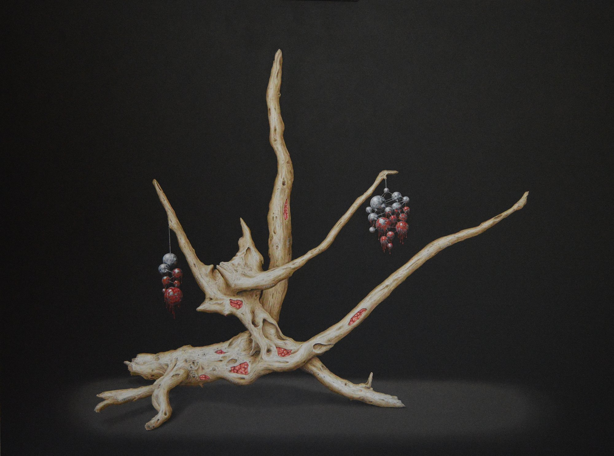

# Requiem — Isabelle du Toit

## 🔗 [isabelledutoit.vercel.app](https://isabelledutoit.vercel.app)

---



A single-page companion site for Isabelle du Toit's **Requiem** series, a hybrid post-digital project where oil painting, symbolic ciphers, and web-linked systems are bound into a single artwork. Standalone from her main portfolio at [isabelledutoit.com](https://isabelledutoit.com).

The featured work, *Mentes Extractae*, examines the uneasy boundary between human thought and machine representation: trees as silent witnesses, brain fragments as extraction, AI vector spaces as a cold cartography of meaning. Each painting in the series carries a cryptic token number painted directly onto the canvas; visitors discover the concept behind it by clicking, then watch the same word travel through a real LLM tokenization → embedding pipeline.

By placing the work inside a public GitHub repository — the platform where the very systems it questions are built — the project quietly inserts itself into the world of developers and technologists, confronting them with questions about authorship, extraction, consent, and the appropriation of human creativity.

## Running

No build step. Clone, then either open `index.html` directly or serve the folder:

```bash
git clone https://github.com/isabelledutoit/requiem.git
cd requiem
python -m http.server 8000
# or
npx serve .
```

Then visit `http://localhost:8000`.

> Internet is required for the Google Font (Patrick Hand) and the background audio. Images are local to the repo and work offline.

## Structure

```
index.html              single-file page — all CSS, JS, HTML
public/artworks/        paintings — MentesFull-md.jpg + 8 detail crops named after their cipher tokens
docs/design-ideas.md    design interview + decisions
```

## Design Language

- **Font**: Patrick Hand (Google Fonts), throughout
- **Palette**: dead dark brown `#15100a`, bone `#f5f0e5`, blood red `#c41e1e`, gold `#a07d30` (accents only)
- **Background**: muted blood and silver orbs on canvas — slow physics, dim opacity, connected by faint silver constellation lines when within 180 px. Honors `prefers-reduced-motion` (renders once, no rAF loop) and scales internal buffer by `devicePixelRatio` for crisp rendering on Retina iPhones/iPads.
- **Mood**: funerary · visceral · post-digital

## Sections

1. **Hero** — *Isabelle du Toit / Requiem Series / Mentes Extractae*, with the artist statement
2. **Slideshow** — 9 slides, full-bleed, paused by default; play/pause toggle advances every 5 s. Each slide pairs a painting with its cipher and a "View Full Requiem Series" link
3. **Tokenizer** — scroll-triggered reveal; 8 masked concept pills + custom input → animates raw word → BPE-style token chips with IDs → 1536-dim vector
4. **Closing statement** — the "Trojan horse" paragraph above the footer divider
5. **Footer** — QR + GitHub source-code card, isabelledutoit.com / Requiem-series links, copyright, build credit

## The Cipher Mechanic

Each slide carries a different token number that is also painted directly onto the canvas of the corresponding work. Clicking a cipher button reveals the word **in place** — the slide stays where it is, no scroll. The same words can then be explored numerically in the tokenizer below.

Slide 01 is the full painting; its cipher button is replaced with a **Decode the Cipher →** CTA that scrolls to the tokenizer.

| Slide | Painting | Cipher | Concept |
|-------|----------|--------|---------|
| 01 | `MentesFull-md.jpg` (full work) | — (CTA → tokenizer) | — |
| 02 | `34012.jpg` | `#34012` | Cruelty |
| 03 | `22345.jpg` | `#22345` | Deception |
| 04 | `19234.jpg` | `#19234` | Oppression |
| 05 | `38659.jpg` | `#38659` | Greed |
| 06 | `12670.jpg` | `#12670` | Apathy |
| 07 | `12896.jpg` | `#12896` | Selfishness |
| 08 | `8716.jpg` | `#8716` | Manipulation |
| 09 | `27891.jpg` | `#27891` | Death |

Isabelle can paint any of the eight token IDs directly onto a work; visitors who arrive here will find the match and decode it.

## Updating Paintings

Swap the image on any slide by editing the `` for that slide's `.slide-art`. Detail crops are stored token-named in `public/artworks/` (e.g. `12670.jpg`); slide 01 uses the size-optimized `MentesFull-md.jpg` (~350 KB; the original is preserved separately as `MentesFull.jpg` archival source).

```html
<div class="slide-art">
    
</div>
```

To change the cipher for a slide, edit its `<button class="slide-cipher-btn" data-word="…" data-mask="#…">…</button>`.

## The Tokenizer

- **Tokenization**: faithful simulation (hand-crafted BPE-like rules, no dependencies)
- **Embeddings**: pre-computed realistic vectors for the eight curated words (32 of 1536 dimensions shown). Custom-input words receive generated illustrative vectors
- **Animation**: three phases — raw word → token chips with IDs → vector stream

The eight pre-computed concepts are: Greed, Apathy, Selfishness, Manipulation, Oppression, Deception, Death, Cruelty.

## Responsive & iOS Polish

- **Layout**: side-by-side row on desktop; stacked column on tablets, touch devices, and phones — including iPad Pro 12.9" landscape — so the embedded cipher numbers stay visible inside the silver frame.
- **Image fit**: `object-fit: contain` on screens ≤1024 px and any touch device; `cover` on desktop pointer environments where the framing is wide enough that nothing essential is cropped.
- **Viewport units**: `100dvh` (dynamic viewport height) on hero and slideshow so the iOS Safari URL bar can't push the scroll hint below the fold or jolt the layout when the bar collapses.
- **Safe area**: `viewport-fit=cover` + `env(safe-area-inset-*)` so notched iPhones in landscape don't clip text under the Dynamic Island.
- **Tap targets**: slide arrows and cipher buttons meet Apple HIG's 44×44 pt minimum.
- **Touch affordance**: the lightbox magnifier badge stays softly visible on touch devices (with a 2.4 s pulse when each slide becomes active) since hover-only cues are invisible on iOS.
- **Tap highlight**: the default gray iOS flash is suppressed for a cleaner palette.

## Links

- **Live site** — [isabelledutoit.vercel.app](https://isabelledutoit.vercel.app)
- Isabelle du Toit — [isabelledutoit.com](https://isabelledutoit.com)
- Requiem series — [isabelledutoit.com/requiem](https://isabelledutoit.com/requiem)
- GitHub (Isabelle) — [github.com/isabelledutoit/requiem](https://github.com/isabelledutoit/requiem)

© Isabelle du Toit. All rights reserved.

## Support

If this project helps you, you can support DreamForge Academy here: [Buy Me a Coffee](https://buymeacoffee.com/dreamforgeacademy).
